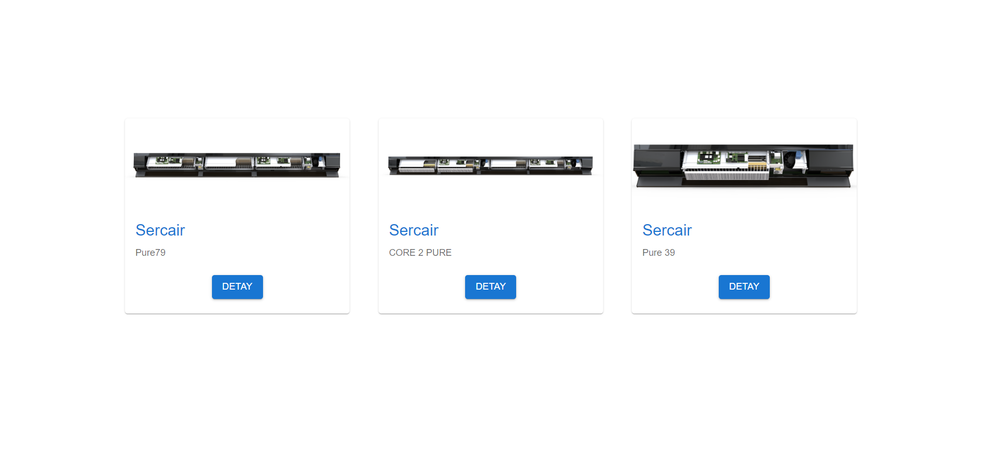

# Sercair Task

## Technologies Used

- ReactJS 
- Axios
- Mui

## Installation

- First, clone the project:

```sh
git clone https://github.com/yigitden/task-sercair.git
```

- Then, start the project on localhost:

```bash
# install dependencies with npm
npm install
# or install dependencies with yarn
yarn
# serve at localhost:3000
npm start
pmark
```

- To start unit testing:

```bash
# with npm
npm run test
# or with yarn
yarn run test
```

<br>
<br>

# Previews
 

## Main Page



## Modal


## Discount Modal
